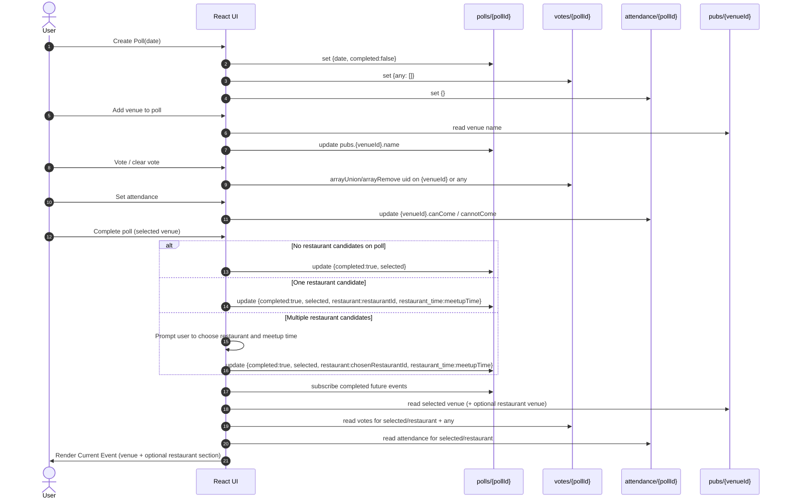

# Firestore Data Contract and Event Data Flow

## Purpose
This document describes the effective Firestore data contract used by the app and the normal event lifecycle:
- create a poll
- add venues to a poll
- vote and attendance updates
- complete poll
- render current event

It also captures the planned future rename from pubs to venues.

## Source of Truth in Code
Key implementation references:
- src/dbtools/polls.js
- src/dbtools/pubs.js
- src/hooks/usePubs.js
- src/hooks/useVotes.js
- src/hooks/useAttendance.js
- src/components/pages/ActivePolls.js
- src/components/pages/CurrentEvents.js
- firestore.rules

## Collections and Document Shapes

### pubs collection
Document id: venue id (historical collection name retained).

Fields commonly used:
- name: string, required for display
- venueType: string enum, one of pub, restaurant, event
- web_site: string optional
- map: string optional
- address: string optional
- notes: string optional
- pubImage: string optional
- parking: boolean optional
- food: boolean optional
- dog_friend: boolean optional
- beer_gerden: boolean optional
- out_of_town: boolean optional

Compatibility rule:
- If venueType is missing, app treats it as pub (see src/hooks/usePubs.js).

### polls collection
Document id: poll id.

Fields:
- date: string in YYYY-MM-DD
- completed: boolean
- pubs: map keyed by venue id
- selected: venue id when completed
- restaurant: venue id when applicable and selected for restaurant branch
- restaurant_time: optional string in HH:mm, meetup time chosen by completer when restaurant is associated
- previous_pubs: array of venue ids, used on reschedule

polls.pubs map shape:
- polls/{pollId}.pubs.{venueId}.name: string
- polls/{pollId}.pubs.any: special global entry used by voting logic

### votes collection
Document id: poll id.

Shape:
- map of venue id to array of user ids
- includes any key for global votes

Examples:
- votes/{pollId}.{venueId}: array of uid
- votes/{pollId}.any: array of uid

### attendance collection
Document id: poll id.

Shape:
- map of venue id to attendance object

Examples:
- attendance/{pollId}.{venueId}.canCome: array of uid
- attendance/{pollId}.{venueId}.cannotCome: array of uid

Important:
- Restaurant attendance uses the same venue-id keyed model, not a separate schema.

### roles collection
Document id: role name.

Shape:
- map where uid keys exist when user has role
- special handling for admin in app logic and rules

### users collection
Document id: uid.

Common fields used:
- name
- notificationEmail
- notificationEmailEnabled
- votesVisible
- openPollEmailEnabled
- photoUrl
- customPhotoUrl

### messages collection
Document id: message id.

Chat message payload, read/write controlled by chat permissions.

### open_actions and comp_actions collections
Support collections used in poll lifecycle workflows and cleanup.

### notification_req and notification_ack collections
These collections provide generic request/ack messaging between the web app and
the notification tool.

Document id:
- poll id for poll-scoped checks
- diagnostics for manual admin checks

Shape:
- arbitrary event key to request value in notification_req
- matching event key to mirrored request value in notification_ack

Examples:
- notification_req/diagnostics.manual: 1743600000000
- notification_ack/diagnostics.manual: 1743600000000
- notification_req/{pollId}.open: 1743600001234
- notification_ack/{pollId}.open: 1743600001234

## Normal Event Data Flow

### Lifecycle Diagram

### 1. Create Poll
User action:
- create a poll date

Writes:
- polls/{pollId} with date and completed false
- votes/{pollId} initialized with any
- attendance/{pollId} initialized empty

### 2. Add Venue To Poll
User action:
- add selected venue to active poll

Write:
- polls/{pollId}.pubs.{venueId}.name set from venue data

### 3. Voting
User action:
- vote up or cancel vote for venue

Writes:
- votes/{pollId}.{venueId} array union/remove uid
- votes/{pollId}.any can also be used

### 4. Attendance
User action:
- can come, cannot come, clear attendance

Writes:
- attendance/{pollId}.{venueId}.canCome and cannotCome arrays updated atomically

### 5. Complete Poll
User action:
- complete poll with selected venue
- optional restaurant choice logic if multiple restaurants on poll

Writes:
- polls/{pollId}.completed true
- polls/{pollId}.selected set
- polls/{pollId}.restaurant set only when applicable
- polls/{pollId}.restaurant_time set only when restaurant is applicable

### 6. Current Event Rendering
Reads:
- future completed polls
- selected venue from polls
- optional restaurant venue from polls.restaurant
- votes and attendance docs by poll id

UI behavior:
- show selected venue details
- show restaurant section only when restaurant field is present and venue exists
- maintain separate attendance controls for main venue and restaurant

## Data Invariants
- A completed poll must have completed true and selected set.
- restaurant field is optional and should only exist when chosen or derived by completion logic.
- restaurant_time is optional and should only exist when restaurant exists on the same poll doc.
- Missing venueType means pub for compatibility.
- Attendance and votes are keyed by venue id within poll-scoped docs.
- Poll deletion should clean up related poll-scoped docs (polls, votes, attendance, open_actions).
- For notification request/ack records, cleanup can be deferred and run as a post-event tidy-up task.

## Access and Permissions Summary
See full rules in firestore.rules.

At a high level:
- pubs: public read, managed write permission
- polls: public read, controlled update/create/delete permissions
- votes and attendance: authenticated read/update, controlled create/delete
- roles and users: restricted by auth and role checks
- notification_req and notification_ack: admin read/write from web app; notification tool uses Admin SDK

## Future Rename Note: pubs to venues
Current state:
- Collection name is pubs, while UI language is Venue.

Planned direction:
- Move to venues collection in a future migration.

Recommendation for migration planning:
- keep this document field-compatible with both names
- later add a migration section with:
1. dual-read period
2. data copy/backfill approach
3. cutover and cleanup plan
